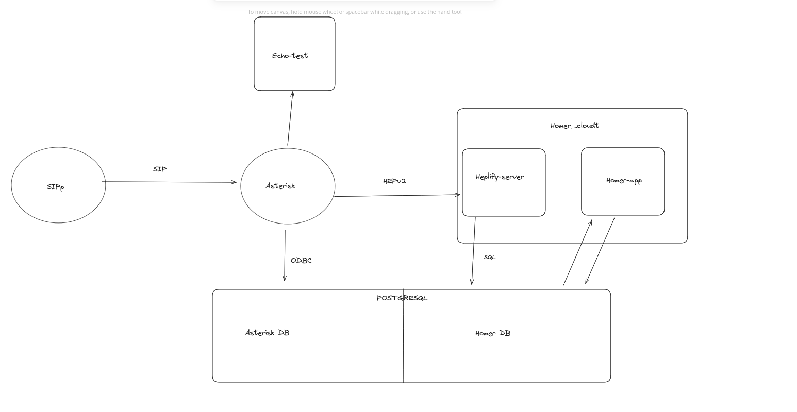
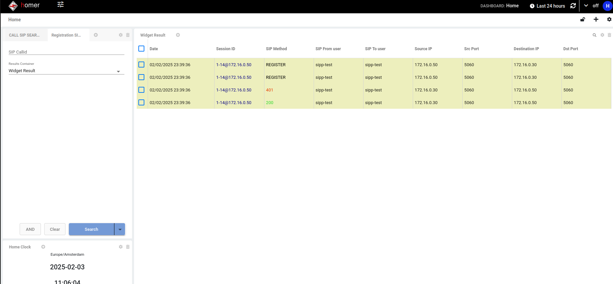

# CloudTalkTask

## Overview
This project is a multi-service Docker-based application designed to simulate and monitor SIP-based communication systems. It includes the following services:
- **PostgreSQL**: Databases for Asterisk realtime data and Homer (`homer_data`, `homer_config`).
- **Asterisk**: A SIP server for receiving SIP messages and forwarding them to Homer via HEP.
- **Homer**: Consists of `heplify-server` for handling HEP messages and storing them in the database, and `homer-app` for providing a user interface for tracing.
- **SIPp**: A SIP traffic generator for testing and simulation.
- **Main-Image**: A Debian-based OS used by all services as the primary operating system.

This project is ideal for testing, development, and learning about SIP-based communication systems.


---

## Table of Contents
1. [Features](#features)
2. [Prerequisites](#prerequisites)
3. [Installation](#installation)
4. [Usage](#usage)
5. [Docker Services](#docker-services)
6. [Acknowledgments](#acknowledgments)
7. [Contact](#contact)

---

## Features
- **Multi-service Docker setup**: Easily deploy all services with a single command.
- **SIP simulation**: Test SIP-based communication using Asterisk and SIPp.
- **Call data capture**: Use Homer to capture, analyze, and visualize SIP traffic.
- **Customizable**: Add or modify services as needed.

---

## Prerequisites
Before you begin, ensure you have the following installed:
- **Docker**: [Install Docker](https://docs.docker.com/get-docker/)
- **Docker Compose**: [Install Docker Compose](https://docs.docker.com/compose/install/)
- **CMake**: [Install CMake](https://cmake.org/download/)
- **Git**: [Install Git](https://git-scm.com/downloads)

---

## Installation
1. Clone the repository:
   ```bash
   git clone https://github.com/Dimbelio/CloudTalkTask.git
   cd CloudTalkTask
   make build-main-image
   make build
   make run 

   ## If you want to stop the containers do:
   make down
   ```

## Usage

### Accessing Services
- **PostgreSQL**: Access the database at `172.16.0.20:5432`.
- **Asterisk**: Connect to the SIP server using a SIP client or use SIPp for testing.
- **Homer-App**: Access the web interface at `http://172.16.0.40:9080`.
- **SIPp**: Use the SIPp container to generate SIP traffic for testing.

---

### Example Commands

#### Generate SIP Traffic with SIPp
1. Navigate to the SIPp directory:
   ```bash
   cd sipp && make exec
   cd tests
   ### Send an unauthorized call to Asterisk (will be rejected with 401):
   sipp asterisk_cloudt:5060 -i 172.16.0.50  -mi 172.16.0.50  -m 1 -d 600 -l 1 -s 15022937089 -sf uac-normal-call.csv -default_behaviors all

   ### Register a user already provisioned in the Asterisk database:
   sipp asterisk_cloudt:5060 -i 172.16.0.50  -mi 172.16.0.50  -m 1 -d 600 -l 1  -sf register.csv -default_behaviors all
   ```

- Track Messages in Homer-App:  
 1. Open your browser and log in to the Homer UI at http://172.16.0.40:9080 using the credentials:

 2. Use the filters to explore SIP messages:
 -  For call legs, use the SIP Call Search.
 -  For registration messages, use the SIP Register Filter.

 3.  Track Messages in the Homer Database (homer_data)
 -  Access the PostgreSQL container
 ```
 cd PostgreSQL && make exec
 psql -U homer_user -d homer_data
 
 ### View available tables:
 \d
 
 ### Query call-related messages:
 select * from hep_proto_1_call;

 ### Query registration-related messages:
 select * from hep_proto_1_registration;
 ```

---  


## Docker Services  
The following services are included in this project:  

| Service Name        | Description                          | Ports/Networks          |  
|---------------------|--------------------------------------|-------------------------|  
| `main-image`        | Main Image            | N/A                     |  
| `postgresql_cloudt` | PostgreSQL database service         | `5432:5432`             |  
| `asterisk_cloudt`   | Asterisk SIP server                  | `5060:5060` (UDP)       |  
| `homer_cloudt`      | Homer SIP capture and analysis tool  | `9080:9080`  `9060:9060`           |  
| `sipp_cloudt`       | SIPp traffic generator               | N/A                     |  

---  


## Acknowledgments  
- **Docker**: For providing an excellent containerization platform.  
- **Asterisk**: For the powerful SIP server.  
- **Homer**: For the SIP capture and analysis tool.  
- **SIPp**: For the SIP traffic generator.  

---  

## Contact  
For questions or feedback, please contact:  
- **Your Name**: Ivan Hristov [hristowivan@gmail.com](mailto:your-email@example.com)  